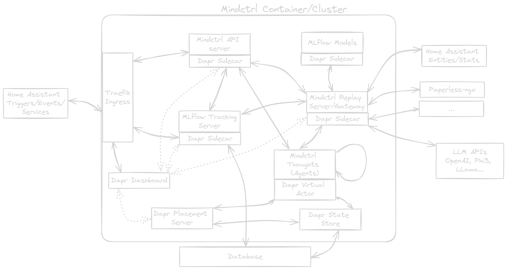
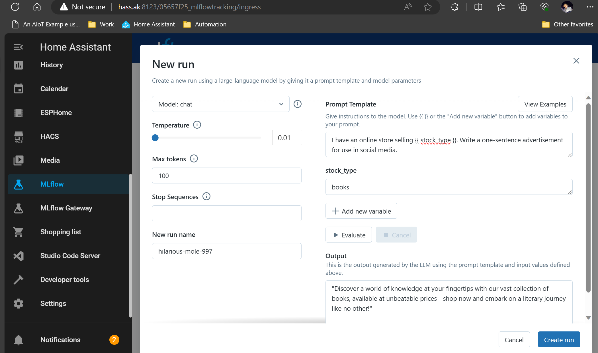

# Mindctrl: Home ~~Automation~~ Intelligence :thought_balloon:

An Intelligence hosting platform for automating your life

---

_Mindctrl architecture, courtesy of the amazing [excalidraw](https://excalidraw.com/)_

A more disciplined incorporation of AI into your home automation setup. This project aims to provide a platform for managing and evaluating conversational prompts for Large Language Models (LLMs) alongside traditional ML techniques in Home Assistant or other home automation platforms (bring your own events and triggers).

## Features

- [x] Manage deployed models or prompts with a versioned registry
- [x] Evaluate prompts with a simple UI
- [ ] Customize your agents

## Platform

- [ ] Scale from [a single device](#home-assistant-addon) :computer: ...
  - [x] to [a selfhosted cluster](#kubernetes) :globe_with_meridians: ...
  - [ ] to [the cloud](#cloud) :cloud:
- [ ] Deploy onto
  - [x] amd64 or ...
  - [x] aarch64 architectures, and feel free to contribute support for ...
  - [ ] the rest
- [ ] Developed on
  - [x] Linux, but it's mostly containerized so it should work on ...
  - [ ] Windows or ...
  - [ ] MacOS with little effort

## Goals / OKRs

1. [Increase Spousal Approval Rating](#reason-about-state-changes) (SAR) by 10% by the end of the quarter
2. [Gain a better understanding](#why) of true AI/ML application deployment + tooling required for successful end-to-end scenarios by building from first principles (no -> light -> heavy AI-focused frameworks)
3. Incorporate latest GenAI techniques to evaluate utility
   - Memory, tool-calling and RAG have lots of room to grow
4. Justify the purchase of a new GPU

## Getting Started

> [!WARNING]
> This project is in early development :see_no_evil: and is not yet ready for production use. Or any use, really. But if you're feeling adventurous, read on!

First, decide how you want to integrate Mindctrl into your home automation setup. You can choose from the following options:

### Home Assistant Addon

1. [Install the Mindctrl Home Assistant Addon](https://www.home-assistant.io/common-tasks/os#installing-third-party-add-ons)
2. Configure the addon with your database and (optional) broker details

### Kubernetes

- [ ] TODO: [TuringPi + K3S instructions](https://docs.turingpi.com/docs/how-to-plan-kubernetes-installation) more scoped to mindctrl. In the interim, intrepid explorers can look at what [the tests do](tests/utils/cluster.py)
- [ ] TODO: Convert the kubectl commands to helm charts

### Cloud

- [ ] TODO: Azure Container Apps instructions

## Why?

- Enable users to manage their LLM prompts and available LLMs from Home Assistant
- Enable users to evaluate changes to their LLM prompts and LLM parameters with versioning + change management
- Centralize credential management for LLMs

### Better manage conversational prompts

Home Assistant has a convenient prompt template tool to generate prompts for LLMs. However, it's not easy to manage these prompts. I can't tell if my new prompt is better than the last one, change tracking is not easy, and live editing means switching between the developer tools and the prompt template tool. There's a better way! Enter MLflow with its new PromptLab UI and integrated evaluation tools + tracking.

### Reason about state changes

LLMs are excellent reasoning agents with unstructured input. Someone familiar with home automation is used to kludgy workarounds:

- presence detection like wasp-in-a-box, or
- using a combination of sensors to determine if someone is home via a weak heuristic, or
- playing around with the bayesian sensor because it's awesome, then slowly losing your mind tweaking the priors

LLMs can be used to reason about state changes more naturally. Can we send the state of multiple sensors and ask the LLM to decide a higher level status in the home?

- (motion, time of day, device usage) -> "is AK asleep?"

## What are you talking about?

- LLM: Large Language Model, a model that can generate text based on a prompt
- [MLflow](https://mlflow.org/): An open source platform for the machine learning lifecycle
- [Home Assistant](https://www.home-assistant.io/): An open source home automation platform
